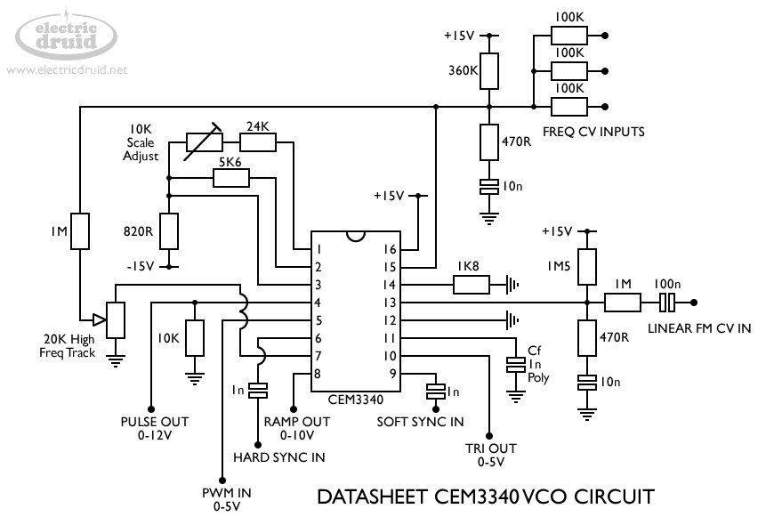

# 3340Experiment
AS3340 Experiments

# Vital Components
Based on http://www.alfarzpp.lv/eng/sc/AS3340.pdf

Sourced through https://syntaxis.com.pl/en/voltage-controlled-oscilators/8-as3340-vco.html

# Status - startup
Move from breadboard to stripboard as breadboard is not stable in any way.

* 820R -> 680R (-12v)
* 470R -> 680R (CV in)
* 24k -> 20k (Rz tracking serial res)
* 1k8 -> 2k (Scale)
* 1M5 -> 1M (+12v pull up FM in)
* 5k6 -> 4k7 (scale adj RT)
## Initial 
| Stage  | Detail | Status |
| ------------- | ------------- | ------------- |
| create material  | sch | AS 3340 datasheet as sch done - next: clone of Prophet 8 |
| | pcb |   |
| | gerber |  |
| production  |   |  |
|  | produced |  |
|  | delivered |  |
## Preliminary validation
| Test  | Detail | Status |
| ------------- | ------------- | ------------- |
| Initial Inspection | |  |
| Initial Technical Test |  |  |
| Initial Technical Test |  |  |
| Initial Product Test |  |  |
| Initial Product Test |  |  |

## Secondary validation
| Test  | Detail | Status |
| ------------- | ------------- |------------- |
| Product Test |  | |
| Product Test |  | |
| Quality |  | |
| Quality | | |
| Long Term Product Test |  |  |
| Power Draw |  | 

## Errata
### Errata - 

## Issues and Notes
### 3340

# Pictures

# Schematic
## AS3340 Data Sheet

# Inspiration
## AS3340 Data Sheet
http://www.alfarzpp.lv/eng/sc/AS3340.pdf

## CEM3340 Data Sheet - Via Electric Druid
CC BY-NC-SA 4.0

https://electricdruid.net/cem3340-vco-voltage-controlled-oscillator-designs/

available under - https://creativecommons.org/licenses/by-nc-sa/4.0/
